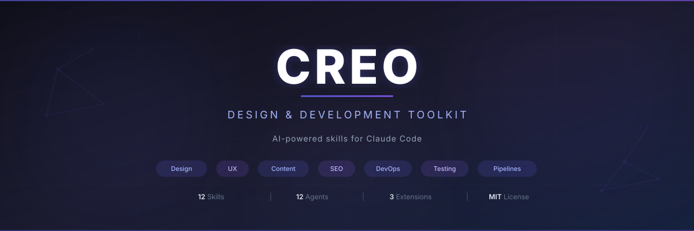

<p align="center">
  
</p>

<p align="center">
  AI-powered design, UX, content, DevOps, and testing toolkit for <a href="https://claude.com/claude-code">Claude Code</a>.
  <br />
  12 specialized skills, 12 parallel subagents, and 3 optional extensions.
</p>

<p align="center">
  <a href="LICENSE"></a>
  <a href="https://github.com/oyusypenko/creo"></a>
</p>

---

## Features

- **Design Review** -- Responsive testing (375-1920px), WCAG AA accessibility, Nielsen's 10 heuristics, visual polish
- **Design Implementation** -- Execute fixes from review reports with verified code changes
- **UX Analysis** -- Analyze your own app flows (internal) or competitor websites (external)
- **Marketing Content** -- JTBD framework, customer pain points, i18n-ready JSON output
- **Image Prompts** -- Generate optimized prompts for DALL-E 3, Midjourney, Stable Diffusion XL
- **SEO Audit** -- Technical SEO, meta tags, structured data, sitemap, content optimization
- **DevOps** -- GitHub, Cloudflare, Railway, Stripe CLI operations via specialized subagents
- **CI/CD Pipelines** -- GitHub Actions workflow creation, debugging, optimization
- **Testing** -- Unit (Vitest/Jest) and E2E (Playwright) test orchestration
- **Marketing Site** -- 7-stage orchestrated site creation (content, SEO, design, localization, QA)
- **AI Generation** -- LLM pipeline expertise (prompt engineering, validation, queues, SSE)

## Quick Start

### Install (Unix/macOS)

```bash
curl -fsSL https://raw.githubusercontent.com/oyusypenko/creo/main/install.sh | bash
```

### Install (Windows)

```powershell
irm https://raw.githubusercontent.com/oyusypenko/creo/main/install.ps1 | iex
```

### Install (Git Clone)

```bash
git clone https://github.com/oyusypenko/creo.git
cd creo
./install.sh
```

### Usage

```
claude                                          # Start Claude Code
/creo design-review http://localhost:3000       # Review a page
/creo content landing                           # Generate landing page copy
/creo seo audit https://example.com             # SEO audit
/creo test unit                                 # Run unit tests
/creo marketing-site full                       # Build full marketing site
```

## Commands

| Command | Purpose |
|---------|---------|
| `/creo design-review <url>` | UI/UX review (responsive, WCAG AA, heuristics) |
| `/creo design-implement <report>` | Execute design fixes from review reports |
| `/creo ux-internal <flow>` | Analyze your own app's UX flows |
| `/creo ux-competitor <url>` | Analyze competitor websites |
| `/creo content <page-type>` | Generate marketing copy (JTBD, pain points) |
| `/creo image-prompt <context>` | Generate image prompts for AI models |
| `/creo seo <url>` | SEO audit & optimization |
| `/creo devops <command>` | Infrastructure (GitHub/Cloudflare/Railway/Stripe) |
| `/creo pipeline <command>` | CI/CD pipeline specialist (GitHub Actions) |
| `/creo test <command>` | Test orchestration (unit + E2E) |
| `/creo marketing-site <command>` | Full marketing site creation (7-stage) |
| `/creo ai-generation <command>` | AI generation pipeline expertise |

## Optional Extensions

Extensions add tool-backed capabilities. Each is self-contained with its own install/uninstall.

| Extension | What it adds | Requirements |
|-----------|-------------|--------------|
| **image-generation** | DALL-E 3 & ComfyUI image generation | Node.js 18+, OPENAI_API_KEY |
| **i18n-translator** | Batch JSON translation (39+ languages) | Python 3, LM Studio |
| **gsc-analyzer** | Google Search Console analysis (15+ analyzers) | Python 3, Google service account |

### Install an extension

```bash
# After cloning the repo:
./extensions/image-generation/install.sh
./extensions/i18n-translator/install.sh
./extensions/gsc-analyzer/install.sh
```

Extension commands become available after install:
- `/creo image-generation generate` -- Generate marketing images
- `/creo i18n translate en uk,pl,de` -- Batch translate locales
- `/creo gsc full-seo https://example.com` -- Full GSC analysis

## Architecture

```
creo/
├── creo/SKILL.md                  # Main orchestrator (entry point)
├── creo/references/               # 12 on-demand knowledge files
├── skills/                        # 12 sub-skills
├── agents/                        # 12 parallel subagents
├── extensions/                    # 3 optional extensions
│   ├── image-generation/          # Node.js (DALL-E 3, ComfyUI)
│   ├── i18n-translator/           # Python (LM Studio)
│   └── gsc-analyzer/              # Python (Google Search Console)
├── install.sh / install.ps1       # One-liner installers
└── uninstall.sh / uninstall.ps1   # Clean removal
```

## Requirements

- [Claude Code](https://claude.com/claude-code) CLI
- Git (for installation)
- Extensions have additional requirements (see extension READMEs)

## Uninstall

```bash
curl -fsSL https://raw.githubusercontent.com/oyusypenko/creo/main/uninstall.sh | bash
```

Extensions must be uninstalled separately via their own uninstall scripts.

## Documentation

- [Architecture](docs/ARCHITECTURE.md) -- System design overview
- [Commands](docs/COMMANDS.md) -- Full command reference
- [Installation](docs/INSTALLATION.md) -- Detailed install guide

## Contributing

See [CONTRIBUTING.md](CONTRIBUTING.md) for guidelines.

## License

[MIT](LICENSE)
